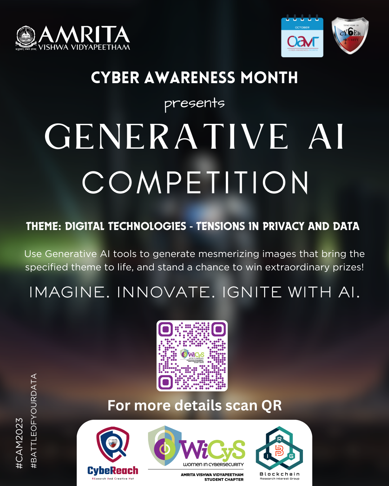
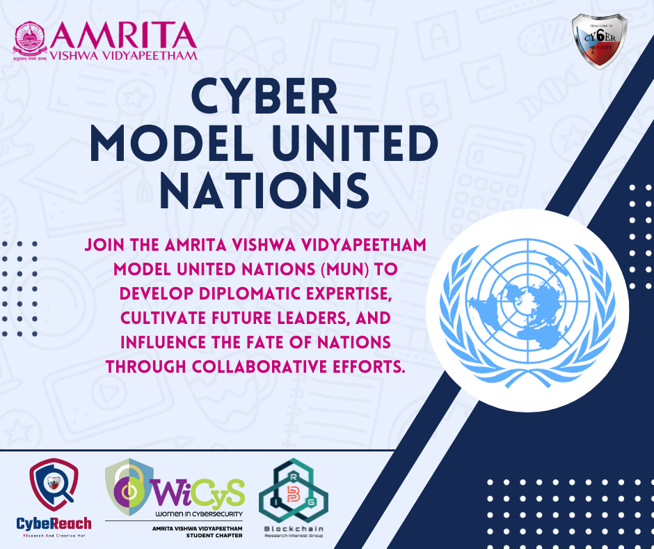

 

<h1><b>CAM EVENTS</b></h1>
<h2>Generative AI</h2>
GENERATIVE AI COMPETITION:

Join us in celebrating Cyber Awareness Month with an innovative twist! As part of our month-long event, we are thrilled to introduce the "Cyber Awareness Month Generative AI Image Competition." This competition is an exciting opportunity for creative minds to use the power of Generative AI to raise awareness about cybersecurity through visually compelling and thought-provoking images. 

The goal of this competition is to explore the capabilities of generative AI in the realm of visual art, where the contestants are expected to leverage AI to generate captivating and original images, pushing the boundaries of creativity and technology, all while staying true to the assigned theme

Eligibility: 
•	Anyone can participate 
•	Individual event 
 
Submission Guidelines:  
•	Image format for submissions: JPEG, PNG, JPG, TIFF, HEIC 
•	Single Submission only. 
•	Submission through only MS Forms (which will be provided by us) 
•	All the prompts and images submitted should be appropriate and should not contain explicit content. A panel will go through the submitted entries to check for NSFW content and any submission which is found to be  violating these regulations will be immediately disqualified and might even be subjected to penalties. 
Resources:  
For beginners who want to explore the world of Gen-AI, we’d like to provide a few resources: 
•	https://hotpot.ai/art-generator?s=dalle-mini 
•	https://stablediffusionweb.com/#demo 
•	https://stablediffusionweb.com/StableDiffusionXL 
•	https://www.seaart.ai/home 
 
 

Below listed are the necessary details that the document that is to be submitted along with the generated images must include: 
 
•	The details of the tool(s)/website(s) used need to be given - mentioning the models used along with the necessary generation data. 
•	A small write-up for each image generated as to how it is related to the theme, as it adds to the context for the image generated. This will help the judges in understanding the thought process behind the submission,  making it easier for the grading process. 
 
Please ensure the following details are filled out in the Microsoft forms sent out by us for registering for the competition: 
•	Full Name 
•	Email Address 
•	Roll number 
•	Year of Study 
•	Department 
•	Phone Number (optional) 
•	The level of your experience with Generative AI 
 
 
Given below are the criteria according to which the submissions will be judged: 
•	Relationship between the theme and images generated 
•	Creativity 
•	Use of prompts and their relationship with the theme and the images 
 
Consent and release: 
The work produced by the winners of the contest may be uploaded on the social media of WiCys Amrita. If you would be okay with the release of your work on the social media handles in case you win, please mention that in the form. 
 
Prizes and rewards: 
 (yet to be decided) 
 
 
Contact details: 
In case of any doubts that need clarification, please feel free to reach out to: 
Yaswanth Gadamsetti- +91 9133332323 
Hemadhri P C- +91 9952348394 
 
 
Theme: 
 
Digital technologies: tensions in privacy and data :  
 
The digital game involves a trade-off between convenience and privacy. People often willingly share personal information online in exchange for free services, but they may not fully understand the consequences of this data sharing. The tension arises when individuals feel that their privacy has been invaded or their data misused. It is related to the tagline Understanding the game behind the Internet use.
 
 
 
 
<h2> CyberMUN</h2> 

MUN is a simulation of the United Nations (UN) that aims to
educate the participants about civics, effective communication,
globalization and multilateral diplomacy.
In MUN, students participate as “delegates” from the UN Member States
and simulate UN committees. From this experience, not only do they
become involved and debate about pressing current issues, but also
broaden their perspectives and their knowledge of international relations
and the UN, allowing delegates to develop their critical thinking and
reasoning skills

